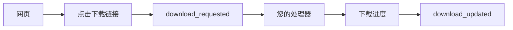

# 下载

Godot CEF 允许你完全接管网页触发的文件下载。当用户点击下载链接或网页触发下载时，CEF 会先向 Godot 发出信号，而不是直接把文件下载到磁盘；由你决定是否允许、保存到哪里、如何展示进度等。

## 工作原理

当网页触发下载时：

1. CEF 拦截下载请求
2. 发出带有文件信息的 `download_requested` 信号
3. 您的代码决定是继续、显示对话框还是忽略
4. 如果下载继续，`download_updated` 信号跟踪进度
5. 最终的 `download_updated` 信号表示完成或取消



::: warning
下载**不会**自动开始。你必须处理 `download_requested` 信号并决定如何处理每个下载。这是一项安全机制，用于避免网站静默下载不需要的文件。
:::

## 基本用法

```gdscript
extends Control

@onready var cef_texture: CefTexture = $CefTexture

func _ready():
    cef_texture.download_requested.connect(_on_download_requested)
    cef_texture.download_updated.connect(_on_download_updated)

func _on_download_requested(info: DownloadRequestInfo):
    print("下载请求:")
    print("  文件: ", info.suggested_file_name)
    print("  URL: ", info.url)
    print("  类型: ", info.mime_type)
    print("  大小: ", _format_bytes(info.total_bytes))
    
    # 显示确认对话框、保存到自定义位置等

func _on_download_updated(info: DownloadUpdateInfo):
    if info.is_complete:
        print("✓ 下载完成: ", info.full_path)
    elif info.is_canceled:
        print("✗ 下载已取消")
    else:
        print("下载中: %d%%" % info.percent_complete)

func _format_bytes(bytes: int) -> String:
    if bytes < 0:
        return "大小未知"
    elif bytes < 1024:
        return "%d B" % bytes
    elif bytes < 1024 * 1024:
        return "%.1f KB" % (bytes / 1024.0)
    else:
        return "%.1f MB" % (bytes / (1024.0 * 1024.0))
```

## 信号

### `download_requested(download_info: DownloadRequestInfo)`

当下载被发起时发出。这发生在：
- 用户点击下载链接
- JavaScript 触发文件下载
- 页面重定向到可下载资源
- 服务器响应 `Content-Disposition: attachment`

**DownloadRequestInfo 属性：**

| 属性 | 类型 | 描述 |
|------|------|------|
| `id` | `int` | 此下载的唯一标识符 |
| `url` | `String` | 正在下载的 URL |
| `original_url` | `String` | 重定向前的原始 URL |
| `suggested_file_name` | `String` | 服务器建议的文件名 |
| `mime_type` | `String` | MIME 类型（例如 `application/pdf`） |
| `total_bytes` | `int` | 文件大小（字节），如果未知则为 -1 |

### `download_updated(download_info: DownloadUpdateInfo)`

在下载进度期间和下载完成或取消时周期性发出。

**DownloadUpdateInfo 属性：**

| 属性 | 类型 | 描述 |
|------|------|------|
| `id` | `int` | 唯一标识符（与 `download_requested` 匹配） |
| `url` | `String` | 正在下载的 URL |
| `full_path` | `String` | 文件保存的完整路径 |
| `received_bytes` | `int` | 目前已下载的字节数 |
| `total_bytes` | `int` | 总文件大小，如果未知则为 -1 |
| `current_speed` | `int` | 当前速度（字节/秒） |
| `percent_complete` | `int` | 进度（0-100），如果未知则为 -1 |
| `is_in_progress` | `bool` | 如果仍在下载则为 `true` |
| `is_complete` | `bool` | 如果成功完成则为 `true` |
| `is_canceled` | `bool` | 如果已取消或失败则为 `true` |

## 常见用例

### 下载确认对话框

```gdscript
var pending_downloads: Dictionary = {}

func _on_download_requested(info: DownloadRequestInfo):
    # 存储下载信息
    pending_downloads[info.id] = info
    
    # 显示确认对话框
    var dialog = ConfirmationDialog.new()
    dialog.dialog_text = "下载 %s？\n大小: %s" % [
        info.suggested_file_name,
        _format_bytes(info.total_bytes)
    ]
    dialog.confirmed.connect(_on_download_confirmed.bind(info.id))
    dialog.canceled.connect(_on_download_declined.bind(info.id))
    add_child(dialog)
    dialog.popup_centered()

func _on_download_confirmed(download_id: int):
    var info = pending_downloads.get(download_id)
    if info:
        print("用户批准下载: ", info.suggested_file_name)
        # 注意：程序化开始下载尚未实现。
        # 接受/开始下载的 API 仍在开发中。
        pending_downloads.erase(download_id)

func _on_download_declined(download_id: int):
    pending_downloads.erase(download_id)
    print("用户拒绝下载")
```

### 下载进度 UI

```gdscript
extends Control

@onready var cef_texture: CefTexture = $CefTexture
@onready var progress_bar: ProgressBar = $DownloadProgress
@onready var speed_label: Label = $SpeedLabel
@onready var status_label: Label = $StatusLabel

var active_downloads: Dictionary = {}

func _ready():
    cef_texture.download_requested.connect(_on_download_requested)
    cef_texture.download_updated.connect(_on_download_updated)
    progress_bar.visible = false

func _on_download_requested(info: DownloadRequestInfo):
    active_downloads[info.id] = {
        "name": info.suggested_file_name,
        "total": info.total_bytes
    }
    progress_bar.visible = true
    progress_bar.value = 0
    status_label.text = "开始: " + info.suggested_file_name

func _on_download_updated(info: DownloadUpdateInfo):
    if not active_downloads.has(info.id):
        return
    
    if info.is_complete:
        status_label.text = "✓ 完成: " + active_downloads[info.id].name
        progress_bar.value = 100
        active_downloads.erase(info.id)
        # 延迟后隐藏
        await get_tree().create_timer(2.0).timeout
        if active_downloads.is_empty():
            progress_bar.visible = false
    
    elif info.is_canceled:
        status_label.text = "✗ 已取消"
        active_downloads.erase(info.id)
        if active_downloads.is_empty():
            progress_bar.visible = false
    
    else:
        progress_bar.value = info.percent_complete if info.percent_complete >= 0 else 0
        var speed_kb = info.current_speed / 1024.0
        speed_label.text = "%.1f KB/s" % speed_kb
        status_label.text = "下载中: %s (%d%%)" % [
            active_downloads[info.id].name,
            info.percent_complete
        ]
```

### 按类型过滤下载

```gdscript
const ALLOWED_MIME_TYPES = [
    "application/pdf",
    "image/png",
    "image/jpeg",
    "application/zip"
]

const BLOCKED_EXTENSIONS = [".exe", ".bat", ".cmd", ".msi", ".scr"]

func _on_download_requested(info: DownloadRequestInfo):
    # 检查 MIME 类型
    if info.mime_type not in ALLOWED_MIME_TYPES:
        print("下载被阻止 - 不允许的 MIME 类型: ", info.mime_type)
        return
    
    # 检查文件扩展名
    var filename = info.suggested_file_name.to_lower()
    for ext in BLOCKED_EXTENSIONS:
        if filename.ends_with(ext):
            print("下载被阻止 - 危险的扩展名: ", ext)
            return
    
    # 允许下载
    print("允许下载: ", info.suggested_file_name)
```

### 跟踪多个同时下载

```gdscript
class_name DownloadManager
extends Node

signal all_downloads_complete

var downloads: Dictionary = {}

func _on_download_requested(info: DownloadRequestInfo):
    downloads[info.id] = {
        "name": info.suggested_file_name,
        "url": info.url,
        "total_bytes": info.total_bytes,
        "received_bytes": 0,
        "status": "pending"
    }
    print("新下载 #%d: %s" % [info.id, info.suggested_file_name])

func _on_download_updated(info: DownloadUpdateInfo):
    if not downloads.has(info.id):
        return
    
    var download = downloads[info.id]
    download.received_bytes = info.received_bytes
    
    if info.is_complete:
        download.status = "complete"
        download.path = info.full_path
        print("下载 #%d 完成" % info.id)
        _check_all_complete()
    
    elif info.is_canceled:
        download.status = "canceled"
        print("下载 #%d 已取消" % info.id)
        _check_all_complete()
    
    else:
        download.status = "downloading"

func _check_all_complete():
    for id in downloads:
        var status = downloads[id].status
        if status == "pending" or status == "downloading":
            return
    emit_signal("all_downloads_complete")

func get_active_count() -> int:
    var count = 0
    for id in downloads:
        if downloads[id].status == "downloading":
            count += 1
    return count

func get_total_progress() -> float:
    var total_bytes = 0
    var received_bytes = 0
    for id in downloads:
        var d = downloads[id]
        if d.total_bytes > 0:
            total_bytes += d.total_bytes
            received_bytes += d.received_bytes
    if total_bytes == 0:
        return 0.0
    return float(received_bytes) / float(total_bytes) * 100.0
```

## 安全注意事项

::: danger
在允许下载之前务必进行验证。恶意网站可能尝试下载有害文件。
:::

### 最佳实践

1. **白名单允许的 MIME 类型** - 只允许您的应用程序需要的文件类型
2. **阻止危险扩展名** - 永远不要允许 `.exe`、`.bat`、`.cmd`、`.msi`、`.scr` 等
3. **验证文件大小** - 拒绝可疑的大型下载
4. **验证 URL 来源** - 只允许来自受信任域名的下载
5. **显示用户确认** - 让用户批准每个下载
6. **沙盒下载文件** - 将下载存储在隔离的目录中

```gdscript
const MAX_DOWNLOAD_SIZE = 100 * 1024 * 1024  # 100 MB
const TRUSTED_DOMAINS = ["example.com", "cdn.example.com"]

func _is_domain_trusted(url: String) -> bool:
    # 从 URL 提取主机名（例如 "https://example.com/path" -> "example.com"）
    var start := url.find("://")
    if start == -1:
        start = 0
    else:
        start += 3
    var end := url.find("/", start)
    var host := ""
    if end == -1:
        host = url.substr(start)
    else:
        host = url.substr(start, end - start)

    # 将主机名与受信任域名比较，允许子域名
    for domain in TRUSTED_DOMAINS:
        if host == domain or host.ends_with("." + domain):
            return true
    return false

func is_download_safe(info: DownloadRequestInfo) -> bool:
    # 检查文件大小
    if info.total_bytes > MAX_DOWNLOAD_SIZE:
        push_warning("下载太大: %d 字节" % info.total_bytes)
        return false
    
    # 使用主机名检查域名，而不是完整 URL 的子字符串
    var url = info.url
    var domain_allowed = _is_domain_trusted(url)
    
    if not domain_allowed:
        push_warning("来自不受信任域名的下载: %s" % url)
        return false
    
    return true
```

## 故障排除

### 下载未触发

- 在加载页面之前验证信号连接是否已设置
- 检查下载链接是否被浏览器安全阻止
- 某些下载需要用户交互（点击）才能触发

### 下载进度不更新

- `download_updated` 信号只在 CEF 报告进度时触发
- 非常快的下载可能在发送进度更新之前就完成了
- 小文件可能会立即下载而没有中间进度

### 缺少文件信息

- 如果服务器不发送 `Content-Length`，`total_bytes` 可能为 -1
- 某些下载类型的 `suggested_file_name` 可能为空
- `mime_type` 取决于服务器响应头

## API 摘要

### 信号

| 信号 | 描述 |
|------|------|
| `download_requested(DownloadRequestInfo)` | 当下载被发起时发出 |
| `download_updated(DownloadUpdateInfo)` | 在进度期间和完成时发出 |

### DownloadRequestInfo

| 属性 | 类型 | 描述 |
|------|------|------|
| `id` | `int` | 唯一下载标识符 |
| `url` | `String` | 下载 URL |
| `original_url` | `String` | 重定向前的 URL |
| `suggested_file_name` | `String` | 建议的文件名 |
| `mime_type` | `String` | MIME 类型 |
| `total_bytes` | `int` | 文件大小（如果未知则为 -1） |

### DownloadUpdateInfo

| 属性 | 类型 | 描述 |
|------|------|------|
| `id` | `int` | 唯一下载标识符 |
| `url` | `String` | 下载 URL |
| `full_path` | `String` | 保存位置 |
| `received_bytes` | `int` | 已接收字节 |
| `total_bytes` | `int` | 总大小（如果未知则为 -1） |
| `current_speed` | `int` | 速度（字节/秒） |
| `percent_complete` | `int` | 进度 0-100（如果未知则为 -1） |
| `is_in_progress` | `bool` | 当前正在下载 |
| `is_complete` | `bool` | 成功完成 |
| `is_canceled` | `bool` | 已取消或失败 |

