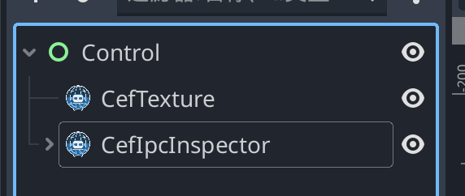

# IPC 检查器

`CefIpcInspector` 是一个内置开发调试覆盖层，用于查看某个 `CefTexture` 的 Godot 与 CEF 渲染进程之间的 IPC 消息。

它可以帮助你快速确认：
- 双向 IPC 是否正常流动
- 当前使用的是哪条通道（`text` / `binary` / `data`）
- 消息预览内容和字节大小
- 消息时序和到达顺序

## 演示视频

<video src="../assets/ipc-inspector-demo.mp4" loop controls autoplay muted></video>

## 可用性

出于安全考虑，IPC 检查器仅在以下场景启用：
- Godot 为调试构建（`OS.is_debug_build() == true`），或
- 从编辑器运行（`Engine.is_editor_hint() == true`）

在发布版中，检查器 UI 不会初始化。

## 快速开始

1. 在场景中同时添加 `CefTexture` 和 `CefIpcInspector`。
    
2. 在 Inspector 面板中，把 `CefTexture` 节点拖到 `target_cef_texture` 属性上。
    <video src="../assets/assign-target-cef-texture-zh.mp4" loop controls autoplay muted></video>
3. 以编辑器运行或 Debug 模式运行场景。
4. 点击右下角 `IPC Inspector` 按钮展开面板。

绑定完成后会立即开始监听 IPC 消息。

## 面板功能

- `All / Incoming / Outgoing` 按方向筛选消息
- `Clear` 清空当前历史
- `Show more / Show less` 展开或折叠长消息
- 历史最多保留 `500` 条（超出后最旧消息会被丢弃）

## `debug_ipc_message` 事件结构

检查器内部监听 `CefTexture.debug_ipc_message(event: Variant)`，其中 `event` 为 `Dictionary`：

| 字段 | 类型 | 说明 |
|------|------|------|
| `direction` | `String` | `to_renderer` 或 `to_godot` |
| `lane` | `String` | `text`、`binary`、`data` |
| `body` | `String` | 消息预览（`binary` 通道以十六进制预览显示） |
| `timestamp_unix_ms` | `int` | Unix 毫秒时间戳 |
| `body_size_bytes` | `int` | 原始负载字节数 |

## 常见问题

- 面板始终不出现：
  - 确认当前是 Debug 构建或编辑器运行模式。
- 显示 `Assign target_cef_texture to a CefTexture node.`：
  - 需要把 `target_cef_texture` 指向实际浏览器节点。
- 没有任何消息：
  - 确认消息确实被发送，并检查当前筛选条件。  你也可以通过 Chrome DevTools 的 REPL 快速发送测试消息。
- 大消息缺失：
  - 超过安全上限的 IPC Data 负载会被丢弃并输出日志。
